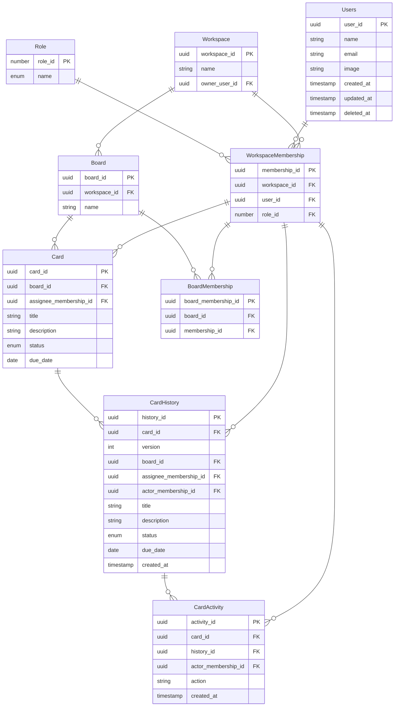

```mermaid
erDiagram

    Role ||--o{ WorkspaceMembership : ""
    Users ||--o{ WorkspaceMembership : ""
    Workspace ||--o{ WorkspaceMembership : ""
    Workspace ||--o{ Board : ""
    Board ||--o{ Card : ""
    WorkspaceMembership ||--o{ Card : ""
    Board ||--o{ BoardMembership : ""
    WorkspaceMembership ||--o{ BoardMembership : ""
    Card ||--o{ CardHistory : ""
    WorkspaceMembership ||--o{ CardHistory : ""
    CardHistory ||--o{ CardActivity : ""
    WorkspaceMembership ||--o{ CardActivity : ""


    Card {
      uuid card_id PK
      uuid board_id FK
      uuid assignee_membership_id FK
      string title
      string description
      enum status
      date due_date
    }

    CardHistory {
      uuid history_id PK
      uuid card_id FK
      int version
      uuid board_id FK
      uuid assignee_membership_id FK
      uuid actor_membership_id FK
      string title
      string description
      enum status
      date due_date
      timestamp created_at
    }

    CardActivity {
      uuid activity_id PK
      uuid card_id FK
      uuid history_id FK
      uuid actor_membership_id FK
      string action
      timestamp created_at
    }

    Board {
        uuid board_id PK
        uuid workspace_id FK
        string name
    }

    BoardMembership {
      uuid board_membership_id PK
      uuid board_id FK
      uuid membership_id FK
    }

    Workspace {
      uuid workspace_id PK
      string name
      uuid owner_user_id FK
    }

    WorkspaceMembership {
      uuid membership_id PK
      uuid workspace_id FK
      uuid user_id FK
      number role_id FK
    }

    Users {
      uuid user_id PK
      string name
      string email
      string image
      timestamp created_at
      timestamp updated_at
      timestamp deleted_at
    }

    Role {
      number role_id PK
      enum name
    }

```
